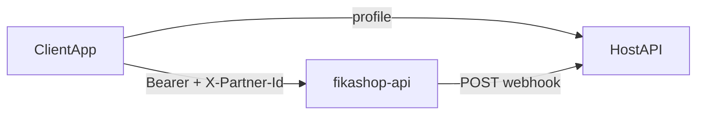

# Fikashop payment gateway — reference

One-page contract for integrating fikashop-api as a **payment-gateway proxy**.

**Model:** the client starts checkout; the host server gets webhooks for final status (especially after redirect payments).



Fixtures: [fixtures/](fixtures/)

---

## 1. Auth and partner context (client)

### OIDC (shared with fikashop)

fikashop-api authenticates via the **FikaChu IdP** at **`https://oidc.fikachu.com`**. It validates `Authorization: Bearer` tokens (OAuth2 introspection).

If your app already signs users in through **oidc.fikachu.com**, reuse the **same access token** on fikashop-api — no separate fikashop login.

| Item | Value |
|------|-------|
| Issuer | `https://oidc.fikachu.com` |
| Discovery | `GET https://oidc.fikachu.com/.well-known/openid-configuration` |
| Token | `POST https://oidc.fikachu.com/token/` |

### Request headers

| Header | Value |
|--------|-------|
| `Authorization` | `Bearer {access_token}` from oidc.fikachu.com |
| `X-Partner-Id` | Partner `code` or numeric `id` (see below) |
| `Content-Type` | `application/json` |

Default API base: `FIKASHOP_API_URL` / `EXPO_PUBLIC_FIKASHOP_API_URL` → `https://api.fikashop.app`

### Resolve `X-Partner-Id`

**Option A — List businesses for the signed-in user (fikashop-native apps)**

```http
GET /shop/api/admin/partners/
Authorization: Bearer {access_token}
```

Returns paginated businesses the user may administer (`results[]`). Use each row's **`code`** (preferred) or **`id`** as `X-Partner-Id`. Let the user pick a business, then:

```ts
client.configurePartner('https://api.fikashop.app', selectedPartner.code);
```

Fixture: [fixtures/partners-list.json](fixtures/partners-list.json)

**Option B — Host app profile (mobility / embedded wallet)**

Some host APIs expose `X-Partner-Id` and `billing_partner_base_url` on the user profile (fikachu-driver example). After profile load:

```ts
client.configurePartner(profile.billing_partner_base_url, xPartnerId);
```

`xPartnerId` is the profile value sent as the **`X-Partner-Id`** header. Do not call wallet/invoice APIs until **X-Partner-Id and base URL** are set.

---

## 2. Payment methods

Methods are **server-driven** — never hardcode lists.

| Use case | GET endpoint | Notes |
|----------|--------------|-------|
| Top-up | `/invoices/api/subscriptions/balance/` | Use `payment_methods`; exclude `code === 'wallet'` |
| Pay invoice | `/invoices/api/public/{uuid}/` | Respect `public_pay_blocked` |

Each method: `code`, `name`, optional `description`, optional `input_fields[]`.

### input_fields

| Property | Purpose |
|----------|---------|
| `code` | Form key **and** submit key (balance API may use `name` — normalize to `code`) |
| `label`, `type`, `is_required`, `help_text`, `default_value` | UI |

| `type` | Control | Submit as |
|--------|---------|-----------|
| `text` | Text input | `string` |
| `boolean` / `checkbox` | Switch | `boolean` |

**Rules:** build form from **selected method only**; reset on method change; submit `{ [field.code]: value }`.

TS helpers: `getInputFieldsForMethod`, `defaultFieldValues`, `validateFieldValues`, `buildDepositPayload`, `buildCapturePayload`.

---

## 3. Checkout flows

### A — Wallet top-up (one POST)

1. `GET /invoices/api/subscriptions/balance/` → balance + methods  
2. User picks method, fills `input_fields`  
3. `POST /invoices/api/subscriptions/wallet-deposit/`

```json
{
  "total": "10000.00",
  "variant": "mpesa",
  "currency": "TZS",
  "description": "Wallet top up",
  "input_fields": { "billing_phone": "+255712345678" }
}
```

4. If `status` is `redirect` → open `redirect_url`

### B — Shared invoice (two steps)

1. `GET /invoices/api/public/{uuid}/`  
2. User picks method (`wallet` → redirect to top-up with invoice balance)  
3. `POST /invoices/api/public/{uuid}/pay/` → `{ "payment_method_code": "mpesa" }`  
4. Response: `payment_reference`  
5. Render selected method's `input_fields`  
6. `POST /payments/process/{payment_reference}/`

```json
{ "action": "capture", "input_fields": { "billing_phone": "+255..." } }
```

7. `GET /invoices/api/public/{uuid}/` to refresh  
8. Same redirect handling as top-up

**Currency** for display comes from the host profile, not the balance endpoint.

### Response statuses

- **Redirect:** `status === 'redirect'` + `redirect_url`  
- **Success:** `paid`, `success`, `settled`, `completed`, `confirmed`  
- **Pending:** `pending`, `processing`, `waiting`, `preauth`

---

## 4. Endpoints (quick table)

| Method | Path | Purpose |
|--------|------|---------|
| GET | `/shop/api/admin/partners/` | Businesses linked to user → `X-Partner-Id` |
| GET | `/invoices/api/subscriptions/balance/` | Balance + deposit methods |
| POST | `/invoices/api/subscriptions/wallet-deposit/` | Top-up |
| GET | `/invoices/api/public/{uuid}/` | Invoice + pay methods |
| POST | `/invoices/api/public/{uuid}/pay/` | Start pay → `payment_reference` |
| POST | `/payments/process/{ref}/` | Submit details (`action: capture`) |
| POST | `{host}/billing/v1/webhooks/fikashop` | Payment status webhook (server) |

---

## 5. Webhooks (host server)

Mobile clients **never** receive webhooks.

### Setup

1. Expose `POST https://{your-api}/billing/v1/webhooks/fikashop`  
2. Set `BILLING_WEBHOOK_SECRET` on host; register same secret in fikashop partner settings  
3. Store `invoice_id` when checkout starts for correlation  
4. Restrict route to server/network only

### Verify

- Header: `X-Fikachu-Signature` = `HMAC-SHA256(secret, raw_body).hexdigest()`  
- Verify **raw request bytes** — do not re-serialize JSON

### Payload

```json
{ "invoice_id": "ext-inv-123", "status": "paid", "event_id": "optional" }
```

(`id` accepted instead of `invoice_id`.)

| Raw status | Normalized |
|------------|------------|
| `open`, `pending`, `processing`, `unpaid` | `pending` |
| `paid`, `settled`, `success`, `completed`, … | `paid` |
| `failed`, `declined`, `canceled`, … | `failed` |

### Handler steps

1. Verify signature → `403` if invalid  
2. Parse JSON; derive `event_id`  
3. Duplicate `event_id` → `200 { "received": true, "duplicate": true }`  
4. Missing `invoice_id` → `400`  
5. Unknown status → `200` ack only  
6. Else update local record by `invoice_id` → `200 { "received": true }`

**Libraries:** `packages/python` (`process_payment_webhook`), `packages/ts` (`verifyFikashopSignature`).

### Local test

```bash
python -c "import hmac,hashlib; s=b'test-secret'; b=b'{\"invoice_id\":\"ext-inv-123\",\"status\":\"paid\"}'; print(hmac.new(s,b,hashlib.sha256).hexdigest())"
```

---

## 6. Pitfalls

- Submit `input_fields` keyed by `code`, not `label` or `name`  
- Re-serializing JSON before HMAC breaks signatures  
- Missing partner config before API calls  
- Relying only on client refresh after redirect — use webhooks for final state

## Out of scope

Trip invoicing, `settlement_rules`, `/webhooks/fikashop/settlements`, wallet withdraw (`wallet-debit`).
