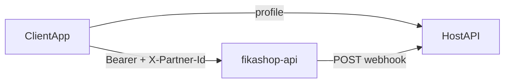

# Fikashop payment gateway — reference

One-page contract for integrating fikashop-api as a **payment-gateway proxy**.

**Model:** the client starts checkout; the host server gets webhooks for final status (especially after redirect payments).



Fixtures: [fixtures/](fixtures/) — see [fixtures/README.md](fixtures/README.md) for the full index.

---

## 1. Auth and partner context

### Server vs client tokens

| Context | Token | Use |
|---------|-------|-----|
| **Client** (React, RN, web) | End-user OIDC `access_token` from `https://oidc.fikachu.com` | Subscribe, wallet, invoice pay, feature bill |
| **Server** (backend jobs) | `FIKASHOP_ADMIN_ACCESS_TOKEN` from fikashop dashboard **Settings → API keys** | Register webhook endpoints, admin partner APIs |

Subscription routes remain **user-scoped** (`IsAuthenticated`). The admin token is the business admin identity — not arbitrary customer impersonation.

**Security:** never embed `FIKASHOP_ADMIN_ACCESS_TOKEN` in `EXPO_PUBLIC_*` or mobile storage. Example: [docs/examples/server-webhook-setup.ts](../docs/examples/server-webhook-setup.ts).

Client checkout examples ([subscribe-and-topup.ts](../docs/examples/subscribe-and-topup.ts), [checkout-invoice.ts](../docs/examples/checkout-invoice.ts)) are **user-token only**.

### OIDC (shared with fikashop)

fikashop-api authenticates via the **FikaChu IdP** at **`https://oidc.fikachu.com`**. It validates `Authorization: Bearer` tokens (OAuth2 introspection).

If your app already signs users in through **oidc.fikachu.com**, reuse the **same access token** on fikashop-api — no separate fikashop login.

| Item | Value |
|------|-------|
| Issuer | `https://oidc.fikachu.com` |
| Discovery | `GET https://oidc.fikachu.com/.well-known/openid-configuration` |
| Token | `POST https://oidc.fikachu.com/token/` |

### Request headers

| Header | Value |
|--------|-------|
| `Authorization` | `Bearer {access_token}` from oidc.fikachu.com |
| `X-Partner-Id` | Partner `code` or numeric `id` (see below) |
| `Content-Type` | `application/json` |

Default API base: `FIKASHOP_API_URL` / `EXPO_PUBLIC_FIKASHOP_API_URL` → `https://api.fikashop.app`

### Resolve `X-Partner-Id`

**Option A — List businesses for the signed-in user (fikashop-native apps)**

```http
GET /shop/api/admin/partners/
Authorization: Bearer {access_token}
```

Returns paginated businesses the user may administer (`results[]`). Use each row's **`code`** (preferred) or **`id`** as `X-Partner-Id`. Let the user pick a business, then:

```ts
client.configurePartner('https://api.fikashop.app', selectedPartner.code);
```

Fixture: [fixtures/partners-list.json](fixtures/partners-list.json)

**Option B — Host app profile (mobility / embedded wallet)**

Some host APIs expose `X-Partner-Id` and `billing_partner_base_url` on the user profile (fikachu-driver example). After profile load:

```ts
client.configurePartner(profile.billing_partner_base_url, xPartnerId);
```

`xPartnerId` is the profile value sent as the **`X-Partner-Id`** header. Do not call wallet/invoice APIs until **X-Partner-Id and base URL** are set.

---

## 2. Payment methods

Methods are **server-driven** — never hardcode lists.

| Use case | GET endpoint | Notes |
|----------|--------------|-------|
| Top-up | `/subscriptions/api/subscriptions/balance/` | Use `payment_methods`; exclude `code === 'wallet'` |
| Pay invoice | `/invoices/api/public/{uuid}/` | Respect `public_pay_blocked` |

Each method: `code`, `name`, `method_type`, optional `description`, optional `image_url`, optional `input_fields[]`.

Synthetic **`wallet`** method (when balance > 0): not a DB row — appended by the balance endpoint with `meta.balance`, `meta.wallet_id`, empty `input_fields`. Exclude `code === 'wallet'` for deposit method pickers.

Fixture: [fixtures/balance-with-methods.json](fixtures/balance-with-methods.json)

### input_fields

| Property | Purpose |
|----------|---------|
| `code` | Form key **and** submit key (balance API may use `name` — normalize to `code`) |
| `label`, `type`, `is_required`, `help_text`, `default_value` | UI |

| `type` | Control | Submit as |
|--------|---------|-----------|
| `text` | Text input | `string` |
| `boolean` / `checkbox` | Switch | `boolean` |

**Rules:** build form from **selected method only**; reset on method change; submit `{ [field.code]: value }`.

TS helpers: `getInputFieldsForMethod`, `defaultFieldValues`, `validateFieldValues`, `buildDepositPayload`, `buildCapturePayload`.

---

## 3. Subscriptions (partner-scoped wallet billing)

**Full detail:** [SUBSCRIPTIONS.md](SUBSCRIPTIONS.md) — every endpoint, feature API, recovery playbook, error matrix, and fixture links. Use that doc for subscription integration; this section is a summary only.

Subscriptions bill from the user's **partner-scoped wallet**. Base path: **`/subscriptions/api/subscriptions/`**

**Billing vs subscribed partner:** `X-Partner-Id` / `?partner=` selects the wallet (stored as `meta.partner_id`). Optional subscribe body `subscribed_partner` and feature query `?subscribed_partner=` select the subscription row for entitlements (`subscribed_partner_id` / `subscribed_partner_code` on responses).

- **Catalog:** `GET …/plans/` → subscribe with `costs[].slug` (not plan slug). Optional `?tags=` (AND), `?point=lng,lat` (geofence; null `service_area` excluded), `?includes=subscribed_plan_cost_id` (active PlanCost UUID or null). Detail: `GET …/plans/{plan_id}/`. Usage: `GET …/usage-by-plan/{plan_id}/`, `GET …/usage-by-id/{subscription_id}/`.
- **Subscribe:** `POST …/` → `active: true` if funded; else `active: false` + `unpaid_invoices[]`; optional body `subscribed_partner`
- **Features:** `GET …/features/{code}/access/` then `POST …/features/{code}/bill/` after each gated action; optional `?subscription_id=`, `?subscribed_partner=`, `?point=`
- **Manage:** `change-plan/`, `cancel/`, `transactions/`
- **Recovery:** wallet top-up (Path A) or pay dunning invoice uuid via Checkout B (Path B) — see [SUBSCRIPTIONS.md § Recovery](SUBSCRIPTIONS.md#recovery-playbook-underfunded-subscribe--failed-renewal)

Key fixtures: [subscriptions-list.json](fixtures/subscriptions-list.json), [subscription-plans.json](fixtures/subscription-plans.json), [subscribe-response.json](fixtures/subscribe-response.json), [subscribe-response-inactive-dunning.json](fixtures/subscribe-response-inactive-dunning.json), [feature-access-allowed.json](fixtures/feature-access-allowed.json), [feature-bill-response.json](fixtures/feature-bill-response.json)

---

## 4. Checkout flows

### A — Wallet top-up (one POST)

1. `GET /subscriptions/api/subscriptions/balance/` → balance + methods  
2. User picks method, fills `input_fields`  
3. `POST /subscriptions/api/subscriptions/wallet-deposit/`

```json
{
  "total": "10000.00",
  "variant": "mpesa",
  "currency": "TZS",
  "description": "Wallet top up",
  "input_fields": { "billing_phone": "+255712345678" }
}
```

4. If `status` is `redirect` → open `redirect_url` (fixture: [fixtures/wallet-deposit-redirect.json](fixtures/wallet-deposit-redirect.json))

### B — Shared invoice (two steps)

1. `GET /invoices/api/public/{uuid}/`  
2. User picks method (`wallet` → redirect to top-up with invoice balance)  
3. `POST /invoices/api/public/{uuid}/pay/` → `{ "payment_method_code": "mpesa" }`  
4. Response: `payment_reference` and `process_url` (fixture: [fixtures/public-pay-init.json](fixtures/public-pay-init.json))  
5. Render selected method's `input_fields` — **submit on capture, not on `/pay/`**  
6. `POST /payments/process/{payment_reference}/` (no `/shop/api` prefix)

```json
{ "action": "capture", "input_fields": { "billing_phone": "+255..." } }
```

7. `GET /invoices/api/public/{uuid}/` to refresh  
8. Same redirect handling as top-up

**Currency** for display comes from the host profile, not the balance endpoint.

**Example:** [docs/examples/checkout-invoice.ts](../docs/examples/checkout-invoice.ts)

### Response shapes

| Step | Key fields | Fixture |
|------|------------|---------|
| Balance + methods | `wallet_id`, `payment_methods[]`, synthetic `wallet.meta` | [balance-with-methods.json](fixtures/balance-with-methods.json) |
| Top-up confirmed | `status: confirmed` (sync providers / emulator) | [wallet-deposit-confirmed.json](fixtures/wallet-deposit-confirmed.json) |
| Top-up redirect | `status: redirect`, `redirect_url`, `meta.intent` | [wallet-deposit-redirect.json](fixtures/wallet-deposit-redirect.json) |
| Invoice detail | items, totals, `external_invoice_reference` | [public-invoice-with-methods.json](fixtures/public-invoice-with-methods.json) |
| Invoice blocked | `public_pay_blocked: true`, empty methods | [public-invoice-blocked.json](fixtures/public-invoice-blocked.json) |
| Pay init (201) | `payment_reference`, `process_url`, `amount`, `currency` | [public-pay-init.json](fixtures/public-pay-init.json) |
| Capture waiting | `status: success`, provider STK initiated | [capture-success.json](fixtures/capture-success.json) |
| Capture redirect | `status: redirect`, `redirect_url` | [capture-redirect.json](fixtures/capture-redirect.json) |
| Capture error | `status: error`, `detail` | [capture-error.json](fixtures/capture-error.json) |
| Webhook paid / pending / failed | `invoice_id`, `status`, `event_id` | [webhook-payment-paid.json](fixtures/webhook-payment-paid.json), [pending](fixtures/webhook-payment-pending.json), [failed](fixtures/webhook-payment-failed.json) |

### Response statuses

- **Redirect:** `status === 'redirect'` + `redirect_url`  
- **Success:** `paid`, `success`, `settled`, `completed`, `confirmed`, `succeeded`  
- **Pending:** `pending`, `processing`, `waiting`, `preauth`

Canonical status lists: [status-map.json](status-map.json)

---

## 5. Endpoints (quick table)

| Method | Path | Purpose |
|--------|------|---------|
| GET | `/shop/api/admin/partners/` | Businesses linked to user → `X-Partner-Id` |
| GET | `/subscriptions/api/subscriptions/` | List subscriptions + wallet balance (`?page=`/`?size=`, `?tags=`, `?point=`) — [subscriptions-list.json](fixtures/subscriptions-list.json) |
| GET | `/subscriptions/api/subscriptions/plans/` | Plan catalog — `?tags=`, `?point=`, `?includes=subscribed_plan_cost_id` — [subscription-plans.json](fixtures/subscription-plans.json) |
| GET | `/subscriptions/api/subscriptions/plans/{plan_id}/` | Plan detail — [subscription-plan-detail.json](fixtures/subscription-plan-detail.json) |
| GET | `/subscriptions/api/subscriptions/usage-by-plan/{plan_id}/` | Usage for plan — [usage-by-plan-response.json](fixtures/usage-by-plan-response.json) |
| GET | `/subscriptions/api/subscriptions/usage-by-id/{subscription_id}/` | Usage by subscription id |
| GET | `/subscriptions/api/subscriptions/features/{code}/access/` | Feature access — [feature-access-allowed.json](fixtures/feature-access-allowed.json) |
| POST | `/subscriptions/api/subscriptions/features/{code}/bill/` | Bill usage — [feature-bill-response.json](fixtures/feature-bill-response.json) |
| GET | `/subscriptions/api/subscriptions/plan-options/` | Alternate costs — [plan-options-all.json](fixtures/plan-options-all.json) |
| POST | `/subscriptions/api/subscriptions/` | Subscribe — [subscribe-response.json](fixtures/subscribe-response.json) |
| POST | `/subscriptions/api/subscriptions/change-plan/` | Change plan — [change-plan-response.json](fixtures/change-plan-response.json) |
| POST | `/subscriptions/api/subscriptions/cancel/` | Cancel — [cancel-response.json](fixtures/cancel-response.json) |
| GET | `/subscriptions/api/subscriptions/transactions/` | History — [subscription-transactions-page1.json](fixtures/subscription-transactions-page1.json) |
| GET | `/subscriptions/api/subscriptions/balance/` | Balance + methods — [balance-with-methods.json](fixtures/balance-with-methods.json) |
| POST | `/subscriptions/api/subscriptions/wallet-deposit/` | Top-up — [wallet-deposit-request.json](fixtures/wallet-deposit-request.json) |

**Idempotency:** send header `Idempotency-Key` (or `X-Idempotency-Key`) on `POST …/subscriptions/`, `POST …/wallet-deposit/`, and `POST …/features/{code}/bill/`. Same key replays the cached response for 24h. SDK: `subscribeToPlan`, `walletDeposit`, and `billFeatureUsage` accept `idempotencyKey`.

| GET | `/invoices/api/public/{uuid}/` | Invoice + pay methods |
| POST | `/invoices/api/public/{uuid}/pay/` | Start pay → `payment_reference` |
| POST | `/payments/process/{ref}/` | Submit details (`action: capture`) — **root path, not under `/shop/api/`** |
| POST | `/shop/api/admin/webhooks/endpoints/` | Register outbound webhook endpoint (preferred) |
| GET | `/shop/api/admin/webhooks/events/` | Delivery log |
| POST | `/shop/api/admin/webhooks/events/{event_id}/replay/` | Replay event |
| GET | `/shop/api/admin/subscription-plans/` | List subscription plans (staff) — [ADMIN-SUBSCRIPTIONS.md](ADMIN-SUBSCRIPTIONS.md) |
| POST | `/shop/api/admin/subscription-plans/` | Create plan + nested costs/features |
| PATCH | `/shop/api/admin/subscription-plans/{id}/` | Update plan; upsert nested arrays |
| DELETE | `/shop/api/admin/subscription-plans/{id}/` | Delete plan (409 if subscribers) |
| PATCH | `/shop/api/admin/plan-costs/{id}/` | Update plan cost |
| DELETE | `/shop/api/admin/plan-costs/{id}/` | Delete plan cost (409 if in use) |
| PATCH | `/shop/api/admin/plan-features/{id}/` | Update plan feature link |
| DELETE | `/shop/api/admin/plan-features/{id}/` | Delete plan feature (409 if usage) |

### Optional / alternate endpoints

| Method | Path | Notes |
|--------|------|-------|
| GET | `/invoices/api/public/{uuid}/payment-methods/` | Methods only (mobile apps) |
| GET | `/subscriptions/api/subscriptions/payment-methods/` | Deposit methods with `?exclude_codes=` |
| GET | `/shop/api/checkout/payment-methods/available/` | Storefront checkout methods (see §7) |

---

## 6. Webhooks (server)

Mobile clients **never** receive webhooks.

### 5a. Unified fikashop-api events (preferred)

Register an endpoint via **`POST /shop/api/admin/webhooks/endpoints/`** (partner-scoped with `X-Partner-Id`). fikashop-api delivers Stripe-style envelopes:

```json
{
  "id": "evt_a1b2c3...",
  "type": "payment.succeeded",
  "api_version": "2026-06-12",
  "created": 1718195525,
  "livemode": true,
  "data": {
    "object": {
      "payment_reference": "9f86d081...",
      "external_invoice_reference": "ext-inv-rider-8842",
      "status": "confirmed",
      "amount": "15000.00",
      "currency": "TZS"
    }
  }
}
```

Fixture: [fixtures/webhook-event-envelope.json](fixtures/webhook-event-envelope.json)

**Verify:** header `Fikashop-Signature: t={unix},v1={hex}` over `{unix}.` + raw body. TS: `verifyUnifiedFikashopSignature`; Python: `verify_unified_fikashop_signature`.

**Event types (v1):**

| Type | When |
|------|------|
| `payment.created` | Gateway payment session opened |
| `payment.processing` | Payment waiting / in flight |
| `payment.succeeded` | Gateway payment confirmed |
| `payment.failed` / `payment.cancelled` | Payment error or cancelled |
| `payment.refunded` | Refund posted |
| `invoice.created` / `invoice.updated` / `invoice.cancelled` | Invoice lifecycle |
| `invoice.payment_succeeded` | Invoice paid or partially paid |
| `invoice.settlement_posted` / `invoice.settlement_failed` | Ledger settlement |
| `wallet.deposit_succeeded` | Wallet top-up credited |
| `subscription.created` | User subscribed via API |
| `subscription.updated` | Activation, renewal, dunning recovery, billing state |
| `subscription.cancelled` | Subscription cancelled |
| `subscription.past_due` | Dunning invoice or failed renewal |

Correlate invoice pay via `data.object.external_invoice_reference` or `invoice_uuid`. Wallet top-ups use `intent: wallet-deposit`. Subscriptions expose `client_reference` and `recovery` hints on API responses.

**Handler libraries:** TS — `processUnifiedWebhook`, `createWebhookRouter`; Python — `process_unified_webhook`, `create_webhook_router`. Examples: [express_webhook.ts](../docs/examples/express_webhook.ts), [fastapi_webhook.py](../docs/examples/fastapi_webhook.py).

Full reference: [fikashop-api docs/README-webhooks.md](../../fikashop-api/docs/README-webhooks.md)

### 5b. Inbound PSP webhooks

Provider callbacks hit **`/payments/webhook/{variant}/`** on fikashop-api. Integrators do not implement these; subscribe to unified outbound events instead.

### Setup

1. Register a partner webhook endpoint via **`POST /shop/api/admin/webhooks/endpoints/`**
2. Expose your receiver URL (HTTPS) and set the same secret on the endpoint
3. Correlate via `data.object.external_invoice_reference` / `invoice_uuid`
4. Restrict the route to server/network only

### Verify

- Header: `Fikashop-Signature: t={unix},v1={hex}` over `{unix}.` + raw body bytes
- Verify **raw request bytes** — do not re-serialize JSON

Fixture: [fixtures/webhook-event-envelope.json](fixtures/webhook-event-envelope.json)

### Payload

Stripe-style envelope (`id`, `type`, `data.object`) — see §5a.

### Handler steps

1. Verify `Fikashop-Signature` → `403` if invalid  
2. Parse JSON; use envelope `id` as `event_id`  
3. Duplicate `event_id` → `200 { "received": true, "duplicate": true }`  
4. Route by `type` → `200 { "received": true }`

**Libraries:** `packages/python` (`process_unified_webhook`, `create_webhook_router`, `verify_unified_fikashop_signature`), `packages/ts` (`processUnifiedWebhook`, `createWebhookRouter`, `verifyUnifiedFikashopSignature`, poll helpers).

### Local test

Use the signed envelope fixture and `verify_unified_fikashop_signature` / `verifyUnifiedFikashopSignature` against a `Fikashop-Signature` header.

---

## 7. Pitfalls

- Submit `input_fields` keyed by `code`, not `label` or `name`  
- Re-serializing JSON before HMAC breaks signatures  
- Missing partner config before API calls  
- Relying only on client refresh after redirect — use webhooks for final state  
- Prefixing `/payments/process/` with `/shop/api/` (wrong — `/payments/` is root-mounted)  
- Subscribing before wallet has sufficient balance — top up first (Checkout A) or handle inactive subscription retry

## 8. Shop checkout (appendix)

For Oscar storefront checkout (not wallet top-up or public invoice pay):

- Live methods: `GET /shop/api/checkout/payment-methods/available/` (not `…/payment-methods/` — that route is schema introspection)
- Checkout payload uses `online-payments` method with `variant` + `input_fields`

See [fikashop-api storefront integration doc](../../fikashop-api/docs/storefront-integration.md).

## Out of scope

Trip invoicing, `settlement_rules`, wallet withdraw (`wallet-debit`).
