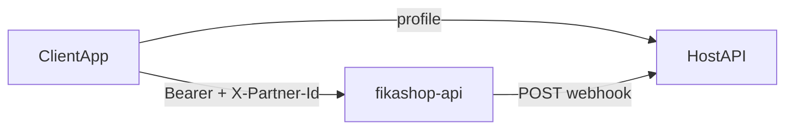

# Fikashop payment gateway — reference

One-page contract for integrating fikashop-api as a **payment-gateway proxy**.

**Model:** the client starts checkout; the host server gets webhooks for final status (especially after redirect payments).



Fixtures: [fixtures/](fixtures/) — see [fixtures/README.md](fixtures/README.md) for the full index.

---

## 1. Auth and partner context (client)

### OIDC (shared with fikashop)

fikashop-api authenticates via the **FikaChu IdP** at **`https://oidc.fikachu.com`**. It validates `Authorization: Bearer` tokens (OAuth2 introspection).

If your app already signs users in through **oidc.fikachu.com**, reuse the **same access token** on fikashop-api — no separate fikashop login.

| Item | Value |
|------|-------|
| Issuer | `https://oidc.fikachu.com` |
| Discovery | `GET https://oidc.fikachu.com/.well-known/openid-configuration` |
| Token | `POST https://oidc.fikachu.com/token/` |

### Request headers

| Header | Value |
|--------|-------|
| `Authorization` | `Bearer {access_token}` from oidc.fikachu.com |
| `X-Partner-Id` | Partner `code` or numeric `id` (see below) |
| `Content-Type` | `application/json` |

Default API base: `FIKASHOP_API_URL` / `EXPO_PUBLIC_FIKASHOP_API_URL` → `https://api.fikashop.app`

### Resolve `X-Partner-Id`

**Option A — List businesses for the signed-in user (fikashop-native apps)**

```http
GET /shop/api/admin/partners/
Authorization: Bearer {access_token}
```

Returns paginated businesses the user may administer (`results[]`). Use each row's **`code`** (preferred) or **`id`** as `X-Partner-Id`. Let the user pick a business, then:

```ts
client.configurePartner('https://api.fikashop.app', selectedPartner.code);
```

Fixture: [fixtures/partners-list.json](fixtures/partners-list.json)

**Option B — Host app profile (mobility / embedded wallet)**

Some host APIs expose `X-Partner-Id` and `billing_partner_base_url` on the user profile (fikachu-driver example). After profile load:

```ts
client.configurePartner(profile.billing_partner_base_url, xPartnerId);
```

`xPartnerId` is the profile value sent as the **`X-Partner-Id`** header. Do not call wallet/invoice APIs until **X-Partner-Id and base URL** are set.

---

## 2. Payment methods

Methods are **server-driven** — never hardcode lists.

| Use case | GET endpoint | Notes |
|----------|--------------|-------|
| Top-up | `/invoices/api/subscriptions/balance/` | Use `payment_methods`; exclude `code === 'wallet'` |
| Pay invoice | `/invoices/api/public/{uuid}/` | Respect `public_pay_blocked` |

Each method: `code`, `name`, `method_type`, optional `description`, optional `image_url`, optional `input_fields[]`.

Synthetic **`wallet`** method (when balance > 0): not a DB row — appended by the balance endpoint with `meta.balance`, `meta.wallet_id`, empty `input_fields`. Exclude `code === 'wallet'` for deposit method pickers.

Fixture: [fixtures/balance-with-methods.json](fixtures/balance-with-methods.json)

### input_fields

| Property | Purpose |
|----------|---------|
| `code` | Form key **and** submit key (balance API may use `name` — normalize to `code`) |
| `label`, `type`, `is_required`, `help_text`, `default_value` | UI |

| `type` | Control | Submit as |
|--------|---------|-----------|
| `text` | Text input | `string` |
| `boolean` / `checkbox` | Switch | `boolean` |

**Rules:** build form from **selected method only**; reset on method change; submit `{ [field.code]: value }`.

TS helpers: `getInputFieldsForMethod`, `defaultFieldValues`, `validateFieldValues`, `buildDepositPayload`, `buildCapturePayload`.

---

## 3. Subscriptions (partner-scoped wallet billing)

Subscriptions bill from the user's **partner-scoped wallet**. Top up the wallet (Checkout A) when subscribe fails for insufficient funds.

Base path: `/invoices/api/subscriptions/` (duplicate: `/subscriptions/api/subscriptions/`).

### Typical UI flow

1. `GET /invoices/api/subscriptions/` — active subscriptions + wallet balance summary
2. `GET /invoices/api/subscriptions/plans/` — plan catalog with nested `costs[]` (each cost has a `slug`)
3. User picks a billing option → `POST /invoices/api/subscriptions/` with `{ "plan_cost_slug": "pro-monthly" }`
4. On success (201), subscription is activated if wallet covers the plan cost; otherwise it stays inactive until funded
5. `GET /invoices/api/subscriptions/transactions/` — wallet ledger history (paginated `results[]`)

Fixtures: [subscriptions-list.json](fixtures/subscriptions-list.json), [subscription-plans.json](fixtures/subscription-plans.json), [subscribe-response.json](fixtures/subscribe-response.json)

### Subscribe

```http
POST /invoices/api/subscriptions/
Authorization: Bearer {access_token}
X-Partner-Id: {partner_code}
Content-Type: application/json

{ "plan_cost_slug": "pro-monthly" }
```

Slug-first: if the `PlanCost` exists, only `plan_cost_slug` is required. Creating new plans/costs via API is for admin/bootstrap flows — integrators normally use slugs from `GET …/plans/`.

### Change plan

```http
POST /invoices/api/subscriptions/change-plan/
{ "subscription_id": "uuid", "target_plan_cost_slug": "pro-yearly", "effective_mode": "immediate" }
```

`effective_mode`: `immediate` (default) or `next_cycle`. Alternate costs for an existing subscription: `GET …/plan-options/?for_subscription={uuid}`.

### Cancel

```http
POST /invoices/api/subscriptions/cancel/
{ "subscription_id": "uuid" }
```

### Wallet + payments link

| Step | Action |
|------|--------|
| Subscribe fails (insufficient wallet) | Run Checkout A (`wallet-deposit`) |
| After top-up confirmed | Retry `POST …/subscriptions/` or wait for billing retry |
| Async top-up confirmation | Handle `wallet.deposit_succeeded` webhook |

---

## 4. Checkout flows

### A — Wallet top-up (one POST)

1. `GET /invoices/api/subscriptions/balance/` → balance + methods  
2. User picks method, fills `input_fields`  
3. `POST /invoices/api/subscriptions/wallet-deposit/`

```json
{
  "total": "10000.00",
  "variant": "mpesa",
  "currency": "TZS",
  "description": "Wallet top up",
  "input_fields": { "billing_phone": "+255712345678" }
}
```

4. If `status` is `redirect` → open `redirect_url` (fixture: [fixtures/wallet-deposit-redirect.json](fixtures/wallet-deposit-redirect.json))

### B — Shared invoice (two steps)

1. `GET /invoices/api/public/{uuid}/`  
2. User picks method (`wallet` → redirect to top-up with invoice balance)  
3. `POST /invoices/api/public/{uuid}/pay/` → `{ "payment_method_code": "mpesa" }`  
4. Response: `payment_reference` and `process_url` (fixture: [fixtures/public-pay-init.json](fixtures/public-pay-init.json))  
5. Render selected method's `input_fields` — **submit on capture, not on `/pay/`**  
6. `POST /payments/process/{payment_reference}/` (no `/shop/api` prefix)

```json
{ "action": "capture", "input_fields": { "billing_phone": "+255..." } }
```

7. `GET /invoices/api/public/{uuid}/` to refresh  
8. Same redirect handling as top-up

**Currency** for display comes from the host profile, not the balance endpoint.

**Example:** [docs/examples/checkout-invoice.ts](../docs/examples/checkout-invoice.ts)

### Response shapes

| Step | Key fields | Fixture |
|------|------------|---------|
| Balance + methods | `wallet_id`, `payment_methods[]`, synthetic `wallet.meta` | [balance-with-methods.json](fixtures/balance-with-methods.json) |
| Top-up confirmed | `status: confirmed` (sync providers / emulator) | [wallet-deposit-confirmed.json](fixtures/wallet-deposit-confirmed.json) |
| Top-up redirect | `status: redirect`, `redirect_url`, `meta.intent` | [wallet-deposit-redirect.json](fixtures/wallet-deposit-redirect.json) |
| Invoice detail | items, totals, `external_invoice_reference` | [public-invoice-with-methods.json](fixtures/public-invoice-with-methods.json) |
| Invoice blocked | `public_pay_blocked: true`, empty methods | [public-invoice-blocked.json](fixtures/public-invoice-blocked.json) |
| Pay init (201) | `payment_reference`, `process_url`, `amount`, `currency` | [public-pay-init.json](fixtures/public-pay-init.json) |
| Capture waiting | `status: success`, provider STK initiated | [capture-success.json](fixtures/capture-success.json) |
| Capture redirect | `status: redirect`, `redirect_url` | [capture-redirect.json](fixtures/capture-redirect.json) |
| Capture error | `status: error`, `detail` | [capture-error.json](fixtures/capture-error.json) |
| Webhook paid / pending / failed | `invoice_id`, `status`, `event_id` | [webhook-payment-paid.json](fixtures/webhook-payment-paid.json), [pending](fixtures/webhook-payment-pending.json), [failed](fixtures/webhook-payment-failed.json) |

### Response statuses

- **Redirect:** `status === 'redirect'` + `redirect_url`  
- **Success:** `paid`, `success`, `settled`, `completed`, `confirmed`, `succeeded`  
- **Pending:** `pending`, `processing`, `waiting`, `preauth`

Canonical status lists: [status-map.json](status-map.json)

---

## 5. Endpoints (quick table)

| Method | Path | Purpose |
|--------|------|---------|
| GET | `/shop/api/admin/partners/` | Businesses linked to user → `X-Partner-Id` |
| GET | `/invoices/api/subscriptions/` | List subscriptions + wallet balance |
| GET | `/invoices/api/subscriptions/plans/` | Plan catalog (nested costs) |
| GET | `/invoices/api/subscriptions/plan-options/` | Alternate costs (`?for_subscription=`) |
| POST | `/invoices/api/subscriptions/` | Subscribe (`plan_cost_slug`) |
| POST | `/invoices/api/subscriptions/change-plan/` | Change billing option |
| POST | `/invoices/api/subscriptions/cancel/` | Cancel subscription |
| GET | `/invoices/api/subscriptions/transactions/` | Wallet transaction history |
| GET | `/invoices/api/subscriptions/balance/` | Balance + deposit methods |
| POST | `/invoices/api/subscriptions/wallet-deposit/` | Top-up |
| GET | `/invoices/api/public/{uuid}/` | Invoice + pay methods |
| POST | `/invoices/api/public/{uuid}/pay/` | Start pay → `payment_reference` |
| POST | `/payments/process/{ref}/` | Submit details (`action: capture`) — **root path, not under `/shop/api/`** |
| POST | `/shop/api/admin/webhooks/endpoints/` | Register outbound webhook endpoint (preferred) |
| GET | `/shop/api/admin/webhooks/events/` | Delivery log |
| POST | `/shop/api/admin/webhooks/events/{event_id}/replay/` | Replay event |

### Optional / alternate endpoints

| Method | Path | Notes |
|--------|------|-------|
| GET | `/subscriptions/api/subscriptions/balance/` | Same as invoices prefix (duplicate mount) |
| GET | `/invoices/api/public/{uuid}/payment-methods/` | Methods only (mobile apps) |
| GET | `/invoices/api/subscriptions/payment-methods/` | Deposit methods with `?exclude_codes=` |
| GET | `/shop/api/checkout/payment-methods/available/` | Storefront checkout methods (see §7) |

---

## 6. Webhooks (server)

Mobile clients **never** receive webhooks.

### 5a. Unified fikashop-api events (preferred)

Register an endpoint via **`POST /shop/api/admin/webhooks/endpoints/`** (partner-scoped with `X-Partner-Id`). fikashop-api delivers Stripe-style envelopes:

```json
{
  "id": "evt_a1b2c3...",
  "type": "payment.succeeded",
  "api_version": "2026-06-12",
  "created": 1718195525,
  "livemode": true,
  "data": {
    "object": {
      "payment_reference": "9f86d081...",
      "external_invoice_reference": "ext-inv-rider-8842",
      "status": "confirmed",
      "amount": "15000.00",
      "currency": "TZS"
    }
  }
}
```

Fixture: [fixtures/webhook-event-envelope.json](fixtures/webhook-event-envelope.json)

**Verify:** header `Fikashop-Signature: t={unix},v1={hex}` over `{unix}.` + raw body. TS: `verifyUnifiedFikashopSignature`; Python: `verify_unified_fikashop_signature`.

**Event types (v1):**

| Type | When |
|------|------|
| `payment.created` | Gateway payment session opened |
| `payment.processing` | Payment waiting / in flight |
| `payment.succeeded` | Gateway payment confirmed |
| `payment.failed` / `payment.cancelled` | Payment error or cancelled |
| `payment.refunded` | Refund posted |
| `invoice.created` / `invoice.updated` / `invoice.cancelled` | Invoice lifecycle |
| `invoice.payment_succeeded` | Invoice paid or partially paid |
| `invoice.settlement_posted` / `invoice.settlement_failed` | Ledger settlement |
| `wallet.deposit_succeeded` | Wallet top-up credited |

Correlate invoice pay via `data.object.external_invoice_reference` or `invoice_uuid`. Wallet top-ups use `intent: wallet-deposit`.

Full reference: [fikashop-api docs/README-webhooks.md](../../fikashop-api/docs/README-webhooks.md)

### 5b. Legacy / other webhook types

| Type | URL | Status |
|------|-----|--------|
| **Legacy settlement** | Per-invoice `settlement_outcome_webhook_url` | Dual-written alongside unified events; deprecated |
| **Host payment status** | `{host}/billing/v1/webhooks/fikashop` | Deprecated — use unified fikashop-api events |
| **Inbound PSP** | `/payments/webhook/{variant}/` on fikashop-api | Not integrator responsibility |

### Setup

1. Expose `POST https://{your-api}/billing/v1/webhooks/fikashop`  
2. Set `BILLING_WEBHOOK_SECRET` on host; register same secret in fikashop partner settings  
3. Store `invoice_id` when checkout starts for correlation  
4. Restrict route to server/network only

### Verify

- Header: `X-Fikachu-Signature` = `HMAC-SHA256(secret, raw_body).hexdigest()`  
- Verify **raw request bytes** — do not re-serialize JSON (whitespace changes the signature)

Fixture: [fixtures/webhook-signed-request.txt](fixtures/webhook-signed-request.txt) (compact JSON body)

### Payload

```json
{ "invoice_id": "ext-inv-123", "status": "paid", "event_id": "optional" }
```

(`id` accepted instead of `invoice_id`.)

Failed example: [fixtures/webhook-payment-failed.json](fixtures/webhook-payment-failed.json)

| Raw status | Normalized |
|------------|------------|
| `open`, `pending`, `processing`, `unpaid`, `preauth` | `pending` |
| `paid`, `settled`, `success`, `completed`, `confirmed`, `succeeded` | `paid` |
| `failed`, `declined`, `canceled`, … | `failed` |

Full map: [status-map.json](status-map.json)

### Handler steps

1. Verify signature → `403` if invalid  
2. Parse JSON; derive `event_id`  
3. Duplicate `event_id` → `200 { "received": true, "duplicate": true }`  
4. Missing `invoice_id` → `400`  
5. Unknown status → `200` ack only  
6. Else update local record by `invoice_id` → `200 { "received": true }`

**Libraries:** `packages/python` (`process_payment_webhook`, `verify_unified_fikashop_signature`), `packages/ts` (`verifyFikashopSignature`, `verifyUnifiedFikashopSignature`).

### Local test

```bash
python -c "import hmac,hashlib; s=b'test-secret'; b=b'{\"invoice_id\":\"ext-inv-123\",\"status\":\"paid\"}'; print(hmac.new(s,b,hashlib.sha256).hexdigest())"
```

---

## 7. Pitfalls

- Submit `input_fields` keyed by `code`, not `label` or `name`  
- Re-serializing JSON before HMAC breaks signatures  
- Missing partner config before API calls  
- Relying only on client refresh after redirect — use webhooks for final state  
- Prefixing `/payments/process/` with `/shop/api/` (wrong — `/payments/` is root-mounted)  
- Subscribing before wallet has sufficient balance — top up first (Checkout A) or handle inactive subscription retry

## 8. Shop checkout (appendix)

For Oscar storefront checkout (not wallet top-up or public invoice pay):

- Live methods: `GET /shop/api/checkout/payment-methods/available/` (not `…/payment-methods/` — that route is schema introspection)
- Checkout payload uses `online-payments` method with `variant` + `input_fields`

See [fikashop-api storefront integration doc](../../fikashop-api/docs/storefront-integration.md).

## Out of scope

Trip invoicing, `settlement_rules`, `/webhooks/fikashop/settlements`, wallet withdraw (`wallet-debit`).
