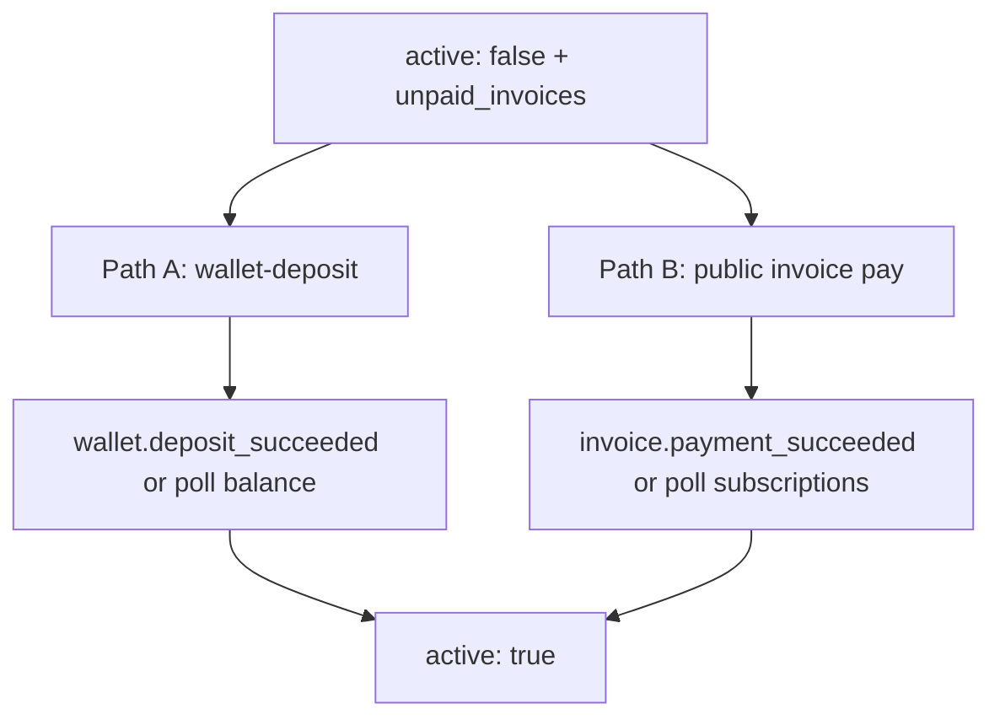

# Subscriptions API — integration guide

Self-contained contract for third-party apps integrating with fikashop-api **Subscriptions** (`/subscriptions/api/subscriptions/`).

**Fixtures:** every response below links to [fixtures/](fixtures/) JSON you can use for UI mocks and SDK tests. Index: [fixtures/README.md](fixtures/README.md).

**Payments cross-links:** wallet top-up (Checkout A), public invoice pay (Checkout B), and webhooks are in [REFERENCE.md](REFERENCE.md) §§3–6.

---

## Short answer

Subscriptions bill from the user's **partner-scoped wallet**. Users subscribe to a **plan cost slug** (e.g. `pro-monthly`) from the catalog — not the plan slug. On subscribe, the wallet is charged immediately:

- Sufficient funds → `active: true`
- Insufficient funds → `active: false` and `unpaid_invoices[]` may list a dunning invoice to collect

The catalog is **read-only** for typical integrators — use slugs from `GET …/plans/`. Metered capabilities use the **feature API**: gate with `GET …/features/{code}/access/`, record usage with `POST …/features/{code}/bill/`.

```text
Bearer + X-Partner-Id
  → GET …/plans/              pick costs[].slug
  → (optional) GET …/balance/
  → POST …/                   subscribe
  → GET …/features/{code}/access/   gate UI / API
  → POST …/features/{code}/bill/    record usage (+ wallet if overage)
  → (optional) POST …/change-plan/ or …/cancel/
```

---

## Authentication and partner scoping

| Header / query | Purpose |
|----------------|---------|
| `Authorization: Bearer {access_token}` | Required — OIDC from `https://oidc.fikachu.com` |
| `X-Partner-Id: {partner_code_or_id}` | Scopes wallet and subscription billing |
| `?partner=` | Alternative to `X-Partner-Id` |

**Resolve partner:** `GET /shop/api/admin/partners/` → use `results[].code` or `id`. Fixture: [partners-list.json](fixtures/partners-list.json).

**Precedence:** query `?partner=` → header `X-Partner-Id` → session `partner_id` (browser only). Numeric = partner PK; non-numeric = partner code (e.g. `acme-mobility`).

Send the **same** `X-Partner-Id` on subscribe, balance, deposit, feature bill, and transactions.

### Subscription `meta` (billing provenance)

Persisted on subscribe; used for renewals when HTTP partner context is absent:

```json
{
  "partner_id": 42,
  "partner_code": "acme-mobility",
  "source": "api_subscribe",
  "plan_cost_slug": "pro-monthly"
}
```

| Key | Meaning |
|-----|---------|
| `partner_id` | Billing partner PK; `null` = global wallet |
| `partner_code` | Denormalized partner code |
| `dunning_paid_invoice_uuids` | Invoice UUIDs already applied to restore billing |

---

## Endpoint summary

Base path: **`/subscriptions/api/subscriptions/`**

| Method | Path | Purpose | Fixture(s) |
|--------|------|---------|------------|
| GET | `/` | List subscriptions + wallet `balance` | [subscriptions-list.json](fixtures/subscriptions-list.json) |
| POST | `/` | Subscribe (`plan_cost_slug`) | [subscribe-response.json](fixtures/subscribe-response.json), [subscribe-response-inactive-dunning.json](fixtures/subscribe-response-inactive-dunning.json) |
| GET | `/plans/` | Plan catalog (`costs[]`, `features[]`) | [subscription-plans.json](fixtures/subscription-plans.json) |
| GET | `/features/{code}/access/` | Check feature access | [feature-access-allowed.json](fixtures/feature-access-allowed.json) |
| POST | `/features/{code}/bill/` | Bill feature usage | [feature-bill-response.json](fixtures/feature-bill-response.json) |
| GET | `/plan-options/` | Alternate costs | [plan-options-all.json](fixtures/plan-options-all.json) |
| POST | `/change-plan/` | Change billing option | [change-plan-response.json](fixtures/change-plan-response.json) |
| POST | `/cancel/` | Cancel subscription | [cancel-response.json](fixtures/cancel-response.json) |
| GET | `/balance/` | Balance + deposit methods | [balance-with-methods.json](fixtures/balance-with-methods.json) |
| GET | `/payment-methods/` | Deposit methods only | [subscription-payment-methods.json](fixtures/subscription-payment-methods.json) |
| GET | `/transactions/` | Wallet history | [subscription-transactions-page1.json](fixtures/subscription-transactions-page1.json) |
| POST | `/wallet-deposit/` | Top-up wallet | [wallet-deposit-request.json](fixtures/wallet-deposit-request.json) |
| POST | `/wallet-debit/` | Withdrawal hold (partner required) | Out of scope — see appendix |

---

## Key concepts

| Concept | Source | Use |
|---------|--------|-----|
| Plan cost | `plans[].costs[].slug` | Value for `plan_cost_slug` on subscribe |
| Subscription | `GET …/` | Billing state, `feature_usage[]` |
| Feature code | `features[]` / `feature_usage[]` | Path segment for access/bill |
| Unpaid invoice | `unpaid_invoices[]` | Pay via public invoice API or top up wallet |
| Billing retry | `billing_retry_exhausted` | When `true`, Celery skips auto-billing until payment succeeds |

`GET …/` returns **all** subscriptions (active, inactive, cancelled). Filter client-side on `active`, `cancelled`, and `unpaid_invoices`.

---

## 1. List subscriptions

```http
GET /subscriptions/api/subscriptions/
Authorization: Bearer {access_token}
X-Partner-Id: {partner_code}
```

**Response `200`:** [subscriptions-list.json](fixtures/subscriptions-list.json)

---

## 2. Subscribe

```http
POST /subscriptions/api/subscriptions/
Authorization: Bearer {access_token}
X-Partner-Id: {partner_code}
Content-Type: application/json
Idempotency-Key: {uuid}

{
  "plan_cost_slug": "pro-monthly",
  "client_reference": "order-8842",
  "metadata": { "cart_id": "cart-99" }
}
```

Optional correlation: [subscribe-request-with-client-reference.json](fixtures/subscribe-request-with-client-reference.json). `client_reference` and `metadata` persist on `UserSubscription.meta` and appear in `subscription.*` webhooks.

| Response | Fixture |
|----------|---------|
| `201` — wallet funded, `active: true` | [subscribe-response.json](fixtures/subscribe-response.json) |
| `201` — underfunded, `active: false` + dunning + `recovery` | [subscribe-response-inactive-dunning.json](fixtures/subscribe-response-inactive-dunning.json) |
| `400` — unknown slug (no bootstrap `plan` block) | [subscribe-error-unknown-slug.json](fixtures/subscribe-error-unknown-slug.json) |

**Recovery hints:** read-only `recovery.recommended_action` — `none` | `wallet_topup` | `pay_dunning_invoice` plus optional `dunning_invoice_uuid`. See [PRODUCTION.md](PRODUCTION.md).

**Idempotency:** repeat the same `Idempotency-Key` within 24h to receive the cached subscribe response (safe retries after network loss).

Slug-first: third-party integrators use slugs from `GET …/plans/` only. Creating plans via API is platform/bootstrap only.

---

## 3. Plan catalog

```http
GET /subscriptions/api/subscriptions/plans/
Authorization: Bearer {access_token}
```

**Response `200`:** [subscription-plans.json](fixtures/subscription-plans.json) — includes `costs[]` and `features[]` with quotas, overage rates, and pricing tiers.

---

## 4. Plan options (change-plan picker)

```http
GET /subscriptions/api/subscriptions/plan-options/
GET /subscriptions/api/subscriptions/plan-options/?for_subscription={uuid}
```

| Query | Response fixture |
|-------|------------------|
| (none) — all costs | [plan-options-all.json](fixtures/plan-options-all.json) |
| `for_subscription` — same plan, exclude current cost | [plan-options-for-subscription.json](fixtures/plan-options-for-subscription.json) |

`change-plan` accepts **any** valid `PlanCost` slug — not limited to the `for_subscription` list.

---

## 5. Change plan

**Request:** [change-plan-request.json](fixtures/change-plan-request.json)

```http
POST /subscriptions/api/subscriptions/change-plan/
Content-Type: application/json

{
  "subscription_id": "f47ac10b-58cc-4372-a567-0e02b2c3d479",
  "target_plan_cost_slug": "pro-yearly",
  "effective_mode": "immediate"
}
```

- `effective_mode` defaults to `"immediate"` — switches plan, updates billing dates, **no wallet charge**, no proration
- `"next_cycle"` returns **400**: [change-plan-error-next-cycle.json](fixtures/change-plan-error-next-cycle.json)

**Response `200`:** [change-plan-response.json](fixtures/change-plan-response.json)

---

## 6. Cancel subscription

**Request:** [cancel-request.json](fixtures/cancel-request.json)

```http
POST /subscriptions/api/subscriptions/cancel/
Content-Type: application/json

{ "subscription_id": "f47ac10b-58cc-4372-a567-0e02b2c3d479" }
```

**Response `200`:** [cancel-response.json](fixtures/cancel-response.json) — pending dunning invoices are voided.

---

## 7. Feature access (read-only)

```http
GET /subscriptions/api/subscriptions/features/sms_outbound/access/
Authorization: Bearer {access_token}
```

Optional: `?subscription_id={uuid}` when the user has multiple active subscriptions. Without it, the **most recently started** active subscription is used.

| Scenario | Status | Fixture |
|----------|--------|---------|
| Allowed | `200`, `allowed: true` | [feature-access-allowed.json](fixtures/feature-access-allowed.json) |
| Quota exhausted | `200`, `allowed: false` | [feature-access-quota-exhausted.json](fixtures/feature-access-quota-exhausted.json) |
| Not on plan | `200`, `allowed: false` | [feature-access-not-on-plan.json](fixtures/feature-access-not-on-plan.json) |
| No active subscription | `403` | [feature-access-no-subscription.json](fixtures/feature-access-no-subscription.json) |
| Unknown feature | `404` | — |

Always call access **before** each gated action. For `rate` features, list `feature_usage[]` may zero `used` when the window elapsed — access is authoritative.

---

## 8. Feature bill (write)

```http
POST /subscriptions/api/subscriptions/features/partner_site_ai_credits/bill/
Authorization: Bearer {access_token}
X-Partner-Id: {partner_code}
Content-Type: application/json

{ "quantity": 1 }
```

Optional: `?subscription_id={uuid}`. `quantity` defaults to `1`, max `100`.

| Scenario | Status | Fixture |
|----------|--------|---------|
| Within quota (no charge) | `200` | [feature-bill-response.json](fixtures/feature-bill-response.json) |
| Overage / usage charge | `200` | [feature-bill-overage-charged.json](fixtures/feature-bill-overage-charged.json) |
| Insufficient wallet | `402` | [feature-bill-insufficient-wallet.json](fixtures/feature-bill-insufficient-wallet.json) |
| Quota exceeded, no overage | `429` | [feature-bill-quota-exceeded.json](fixtures/feature-bill-quota-exceeded.json) |

### Billing rules by `feature_type`

| Type | Access | Bill |
|------|--------|------|
| `boolean` | `allowed` true/false | Not billable (`400`) |
| `quota` | `used`, `remaining`, `quota` | Increments usage; overage debits wallet when `overage_rate` set |
| `rate` | Windowed `remaining` | Increments within window; no wallet charge |
| `usage` | Usage counters | Always debits wallet per `overage_rate` / tiers |

**Concurrency:** no idempotency key on bill. Bill immediately after a successful action, or accept `402`/`429` if another request consumed quota first. After overage with wallet debit, `remaining` may be **negative**.

### HTTP status matrix

| Situation | Access | Bill |
|-----------|--------|------|
| Allowed / billed | `200`, `allowed: true` | `200`, `status: "billed"` |
| Feature not on plan | `200`, `allowed: false` | `400` |
| Quota / rate exhausted (no overage) | `200`, `allowed: false` | `429` |
| No active subscription | `403` | `403` |
| Insufficient wallet | — | `402` |

---

## 9. Wallet balance and deposit methods

```http
GET /subscriptions/api/subscriptions/balance/
X-Partner-Id: {partner_code}
```

**Response `200`:** [balance-with-methods.json](fixtures/balance-with-methods.json)

Exclude `code === 'wallet'` from deposit method pickers. Synthetic `wallet` entry includes `meta.balance`, `meta.wallet_id`, `meta.partner`.

Alternative: `GET …/payment-methods/?exclude_codes=cash,wallet` → [subscription-payment-methods.json](fixtures/subscription-payment-methods.json)

### Wallet top-up

See [REFERENCE.md §4 Checkout A](REFERENCE.md#a--wallet-top-up-one-post). Request: [wallet-deposit-request.json](fixtures/wallet-deposit-request.json). Responses: [wallet-deposit-confirmed.json](fixtures/wallet-deposit-confirmed.json), [wallet-deposit-redirect.json](fixtures/wallet-deposit-redirect.json).

---

## 10. Wallet transactions

```http
GET /subscriptions/api/subscriptions/transactions/?page=1&size=20
X-Partner-Id: {partner_code}
```

**Response `200`:** [subscription-transactions-page1.json](fixtures/subscription-transactions-page1.json)

Default `size=15`, max `10000`. Results newest first. `transaction_type` values include `deposit`, `subscription`, `purchase`, `refund`, `cancellation`.

---

## Recovery playbook (underfunded subscribe / failed renewal)

When wallet debit fails at subscribe or renewal, a **pending dunning invoice** appears in `unpaid_invoices[]` (use `uuid`, not parsed `payment_terms`).



### Path A — Wallet top-up

1. `POST …/wallet-deposit/` with sufficient `total`
2. Wait for credit:
   - **Webhook (preferred):** `wallet.deposit_succeeded` — [webhook-wallet-deposit-succeeded.json](fixtures/webhook-wallet-deposit-succeeded.json)
   - **Poll:** `GET …/balance/` or `GET …/transactions/`
3. Celery retries wallet debit on a **~1 minute** schedule
4. Confirm `active: true` via `GET …/subscriptions/`

### Path B — Pay dunning invoice

1. Use `unpaid_invoices[].uuid`
2. Public invoice flow — [REFERENCE.md §4 Checkout B](REFERENCE.md#b--shared-invoice-two-steps):
   - `GET /invoices/api/public/{uuid}/`
   - `POST /invoices/api/public/{uuid}/pay/`
   - `POST /payments/process/{ref}/` with `action: capture`
3. When invoice is **paid**, subscription restores **without a second wallet debit**
4. Confirm via `invoice.payment_succeeded` webhook or poll `GET …/subscriptions/`

### When auto-retry stops

If `billing_retry_exhausted` is `true`, Celery skips automatic billing until payment succeeds. `payment_failure_notify_count` tracks dunning notifications for the current cycle.

Plan `grace_period` (days) affects dunning invoice `due_date`. During extended grace, a failed renewal may keep `active: true` while dunning runs.

---

## Webhooks (server-side sync)

Mobile and browser clients should **poll**; backend integrators register webhooks — [REFERENCE.md §6](REFERENCE.md#6-webhooks-server).

| Event | When to use |
|-------|-------------|
| `wallet.deposit_succeeded` | Wallet top-up confirmed — refresh balance, retry subscribe |
| `invoice.payment_succeeded` | Dunning invoice paid — refresh subscription state |
| `payment.succeeded` / `payment.failed` | Gateway session during deposit or public pay |

There are **no** partner webhooks for subscription activated/cancelled — poll `GET …/subscriptions/` or use wallet/invoice events above.

Register: `POST /shop/api/admin/webhooks/endpoints/` with `X-Partner-Id`.

---

## Errors (quick reference)

| Condition | Status | Action |
|-----------|--------|--------|
| Not authenticated | `401` | Re-authenticate |
| Bad / missing `plan_cost_slug` | `400` | Use slug from `GET …/plans/` |
| `next_cycle` change plan | `400` | Use `immediate` |
| Feature not billable | `400` | Use access only |
| No active subscription | `403` | Subscribe first |
| Unknown feature code | `404` | Use codes from catalog |
| Insufficient wallet on subscribe | `201`, `active: false` | Top up or pay dunning invoice |
| Auto-billing stopped | `billing_retry_exhausted: true` | Pay dunning or top up |
| Insufficient wallet on feature bill | `402` | Top up wallet |
| Quota / rate limit exceeded | `429` | Upgrade, wait, or enable overage |

---

## Integration checklist

- Set `X-Partner-Id` before wallet/subscribe calls
- Use `plan_cost_slug` from `GET …/plans/` (not plan slug)
- Gate paid features with `GET …/features/{code}/access/`
- Record usage with `POST …/features/{code}/bill/` after successful actions
- Handle `unpaid_invoices[]` when `active` is false
- Pass `?subscription_id=` when user has multiple active subscriptions
- Use wallet deposit for balance changes; use public invoice pay for dunning collection

---

## SDK (TypeScript)

```ts
import {
  listSubscriptions,
  getSubscriptionPlans,
  subscribeToPlan,
  changePlan,
  cancelSubscription,
  getPlanOptions,
  getSubscriptionTransactions,
  checkFeatureAccess,
  billFeatureUsage,
  getDepositPaymentMethods,
  walletDeposit,
} from '@fikashop/payment-gateway-client';
```

Examples: [docs/examples/subscribe-and-topup.ts](../docs/examples/subscribe-and-topup.ts), [feature-gating-and-bill.ts](../docs/examples/feature-gating-and-bill.ts), [dunning-recovery.ts](../docs/examples/dunning-recovery.ts).

---

## Appendix: wallet debit (out of scope)

`POST …/wallet-debit/` creates a withdrawal hold invoice (partner **required**). Not part of typical payment-gateway integration — see OpenAPI `/docs/` if your product needs payout holds.

---

## Related

- Payments overview: [REFERENCE.md](REFERENCE.md)
- Status normalization: [status-map.json](status-map.json)
- All fixtures: [fixtures/README.md](fixtures/README.md)
